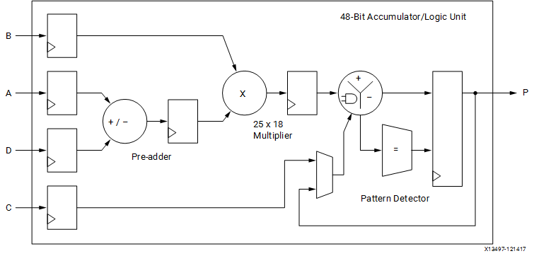

# OPU PE

## What does MU do?

In general, it serves as a multiplier to calculate the multiplication operations in convolution process. The key idea of PE is supporting data with different width. It supports multiplication between 8-bit, 4-bit, and 2-bit \(in process\) data. This module receives 16-bit data as `x` and 8-bit data as `y`. For 8-bit data, the data structure of `x` is `[x0, x1]` , in which `x0` and `x1` are both 8 bit data. Following the same logic, the input `x` could be composed of 4 4-bit data or 8 2-bit data.

| width | `x` | `y` | `p` |
| :--- | :--- | :--- | :--- |
| 8-bit | \[`x0`\(8-bit\), `x1`\(8-bit\)\] | `y`\(8-bit\) | \[`x0*y`\(16-bit\), `x1*y`\(16-bit\)\] |
| 4-bit | \[`x0`\(4-bit\),  `x1`\(4-bit\), `x2` \(4-bit\), `x3`\(4-bit\)\] | `y`\(4-bit\) | \[`x0*y`\(8-bit\),  `x1*y`\(8-bit\), `x2*y` \(8-bit\), `x3*y`\(8-bit\)\] |
| 2-bit | \[`x0`\(2-bit\),  `x1`\(2-bit\), `x2` \(2-bit\), `x3`\(2-bit\), `x4`\(2-bit\),  `x5`\(2-bit\), `x6` \(2-bit\), `x7`\(2-bit\)\] | `y`\(2-bit\) | \[`x0*y`\(4-bit\),  `x1*y`\(4-bit\), `x2*y` \(4-bit\), `x3*y`\(4-bit\), `x4*y`\(4-bit\),  `x5*y`\(4-bit\), `x6*y` \(4-bit\), `x7*y`\(4-bit\)\] |

## Architecture of DSP48

The main operation is done by DSP48 block, which is the most complex computational block available in a Xilinx FPGA. 



> The DSP48 block is an arithmetic logic unit \(ALU\) embedded into the fabric of the FPGA and is composed of a chain of 3 different block. The computational chain in the DSP48 contains an add/subtract until connected to a multiplier connected to a final add/subtract/accumulate engine. This chain allows a single DSP48 unit to implement functions of the form $$P=B\times(A+D)+C$$ or $$P+=B\times(A+D)$$

It is consisted of 4 input ports, D, A, B, C, whose width is **25, 30, 18, 48**. The signals in DSP48 are all **signed**. In OPU PE, we use DSP48 to implement function of the form $$P=(A+D)\times B+C$$ .

## Implementation of multiplication unit \(MU\)

### Input and Output ports

```text
output  reg    [31 : 0]       p;

input           [15 : 0]      x;
input           [ 7 : 0]      y;
input                         mode;

input                         clk;
input                         reset;
```

### DSP48 ports

```text
reg             [24 : 0]      dsp_d = 0;
reg             [24 : 0]      dsp_a = 0;
reg             [17 : 0]      dsp_b = 0;
reg             [47 : 0]      dsp_c = 0;
```

### 8-bit multiplication

When `mode==0`, the MU runs in 8-bit multiplication mode. 

```text
dsp_a <= $signed(x_s[7 : 0]);
dsp_d <= $signed(x_s[15 : 8]) << 16;
```

The data `x1`and `x0` are extracted from input data `x` \(`x_s` is 1 cycle delay of `x`\) and sent to DSP48 through D and A port after expanded to 16-bit. 

```text
dsp_b <= $signed(y_s) 
```

As for `y`, it is sent to port B after 1 cycle delay. The signal for port C is always 0. So, the concept is easy to understand. The calculation could be written as $$[x_0, x_1]\times y=[x_0y, x_1y]$$. Since `x0` and `x1`are expanded from 8-bit to 16-bit before multiplication, the two output are not overlap and no additional operation is needed.

### 4-bit multiplication

When `mode==1`, the MU runs in 4-bit multiplication mode. Its mechanism is much more complicated because the input data could be no longer expanded and some bits of output have to overlap. Additional effort is needed to solve this problem.

```text
assign dsp_a_part0  = $signed(x_s[3 : 0]);
assign dsp_a_part1  = {{(3){x_s[7]}}, x_s[7 : 4]} - {6'h0, x_s[3]};
assign dsp_a_part2  = {{(3){x_s[11]}}, x_s[11 : 8]} - {6'h0, dsp_a_part1[6]};

always @(posedge clk) begin
    if ( mode )
      dsp_a <= $signed({dsp_a_part2, dsp_a_part1, dsp_a_part0});
    else
      dsp_a <= $signed(x_s[7 : 0]);
end
```

The input data `x` \(16-bit\) is composed of 4 4-bit data. The last 3 of them are stored in `dsp_a` and the left is stored in `dsp_d`. Because of the limited width of A and D port of DSP48, which is 25, we could not expand each input data from 4-bit to 8-bit. So, the last 3 input data are expanded to 7-bit and the left in `dsp_d` remains 4-bit. The result of $$(D+A)$$ should be \[`x0`\(4-bit\), `x1'`\(7-bit\), `x2'`\(7-bit\), `x3'`\(7-bit\)\]. Of course, `x1`, `x2`, and `x3` are modified to fit the overlay of output.

#### Multiplication of negative binary

As we see in the above code block, the structure of expanded input data is really weird. It not only expands the sign bit, but also minuses 1 bit of next data. To better understand the mechanism, I have to talk about the multiplication of negative binary first. It is well discussed in this post \([https://math.stackexchange.com/questions/1463651/binary-multiplication-for-negative-numbers](https://math.stackexchange.com/questions/1463651/binary-multiplication-for-negative-numbers)\). 

```text
              1 1 1 1 1 0 1 1 = -5
            * 1 1 1 1 1 1 0 1 = -3
--------------------------------------------
              1 1 1 1 1 0 1 1
            0 0 0 0 0 0 0 0 |
          1 1 1 1 1 0 1 1   |
        1 1 1 1 1 0 1 1     |
      1 1 1 1 1 0 1 1 |     |
    1 1 1 1 1 0 1 1   |     |
  1 1 1 1 1 0 1 1     |     |
1 1 1 1 1 0 1 1       |     |
--------------------------------------------
   discarded| 0 0 0 0 1 1 1 1 = +15
```

As shown in above code block, the widths of 2 operands are both 4-bit. The 2 operands, -5 \(0b1011\) and -3 \(0b1101\), are expanded to 8-bit, which is the expected width \(8-bit\) of the output of multiplication. The total width of the output of multiplication is 16 \(15+1\), but we only choose 8-bit from least significant side to be the final output.In this way, we are able to calculate the multiplication of negative binary.

Let us go back to the MU. Suppose the input data in `dsp_a` is not modified and the last few bits are `b3, b2, b1, b0, a3, a3, a3, a3, a2, a1, a0`. We also expand the data of `y` to 8-bit. The multiplication should be

```text
b3   b2   b1   b0   a3   a3   a3   a3   a2   a1   a0
               y3   y3   y3   y3   y3   y2   y1   y0            
----------------------------------------------------
b3y0 b2y0 b1y0 b0y0|a3y0 a3y0 a3y0 a3y0 a2y0 a1y0 a0y0
b2y1 b1y1 b0y1 a3y1|a3y1 a3y1 a3y1 a2y1 a1y1 a0y1
b1y2 b0y2 a3y2 a3y2|a3y2 a3y2 a2y2 a1y2 a0y2
b0y3 a3y3 a3y3 a3y3|a3y3 a2y3 a1y3 a0y3
a3y3 a3y3 a3y3 a3y3|a2y3 a1y3 a0y3
a3y3 a3y3 a3y3 a2y3|a1y3 a0y3
a3y3 a3y3 a2y3 a1y3|a0y3
a3y3 a2y3 a1y3 a0y3|
a2y3 a1y3 a0y3     |
a1y3 a0y3          |
----------------------------------------------------
          discarded|
```

~~To be honest, I am not familiar with the multiplication in DSP48. So what I am talking is totally out of my own understanding.~~ 

Although we expand the 4-bit y to 8-bit, we only select the last 7-bit result. The reason might be that at the 8th bit, it has `b0` as an add operand, which has nothing to do with `a`. Let us compare this with normal 4-bit multiplication of negative binary.

```text
               a3   a3   a3   a3   a3   a2   a1   a0
               y3   y3   y3   y3   y3   y2   y1   y0            
----------------------------------------------------
               a3y0 a3y0 a3y0 a3y0 a3y0 a2y0 a1y0 a0y0
          a3y1 a3y1 a3y1 a3y1 a3y1 a2y1 a1y1 a0y1
     a3y2 a3y2 a3y2 a3y2 a3y2 a2y2 a1y2 a0y2
a3y3 a3y3 a3y3 a3y3 a3y3 a2y3 a1y3 a0y3
a3y3 a3y3 a3y3 a3y3 a2y3 a1y3 a0y3
a3y3 a3y3 a3y3 a2y3 a1y3 a0y3
a3y3 a3y3 a2y3 a1y3 a0y3
a3y3 a2y3 a1y3 a0y3
a2y3 a1y3 a0y3|
a1y3 a0y3     |
----------------------------------------------------
     discarded|
```

We could find that two outputs share the same least 7-bit. The only difference is the 8th bit. The 8th bit of normal multiplication is \( $$C_7$$ means the carry from 7th bit\):

$$a_3y_0+a_3y_1+a_3y_2+a_3y_3+a_3y_3+a_2y_3+a_1y_3+a_0y_3 + C_7 \\ =a_3(y_0+y_1+y_2+y_3)+y_3(a_3+a_2+a_1+a_0)+C_7$$ 

The 7th bit of normal multiplication and MU is:

$$a_3y_1+a_3y_2+a_3y_3+a_3y_3+a_2y_3+a_1y_3+a_0y_3+C_6 \\ =a_3(y_1+y_2+y_3)+y_3(a_3+a_2+a_1+a_0)+C_6$$ 

We could find that the only difference is $$a_3y_0$$. This is fixed by the addition with `dsp_c[0]`.

```text
assign  dsp_c_flag[0] = (x_s[3] ^ y_s[3]) & (|x_s[3 : 0]) & (|y_s[3 : 0]);
```

According to the code,  `dsp_c_flag[0]` is composed of 3 parts. The first part is `xs[3]^ys[3]`. This is used to determine if `x3` and `y` share the same sign bit, which means that $$a_3y_3?=1$$ . The last 2 parts are used to determine if `x3` or `y` is of 0 value, which means that $$x_3+x_2+x_1+x_0\neq0$$ and $$y_3+y_2+y_1+y_0\neq0$$ . 


